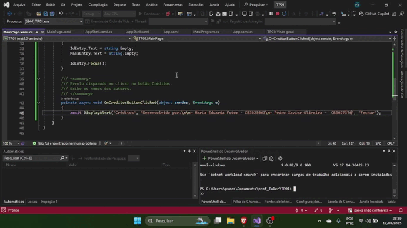

# Trabalho Prático 01

Este repositório contém o código-fonte de uma Aplicação Teste desenvolvida em MAUI, conforme especificado no Trabalho Prático 01 da disciplina CBTPRDM do IFSP Cubatão.

## Descrição do Projeto

A Aplicação Teste é um aplicativo simples com uma tela de login que permite ao usuário inserir um ID e uma senha. Possui botões para realizar a validação do login, limpar os campos de entrada e visualizar o crédito do autor do APP.

## Funcionalidades

*   **Campos de Texto:** Permitem a inserção do ID e da senha.
*   **Botão OK:** Realiza uma validação simples. Se o usuário digitar "admin" no campo ID e "senha@dmin" no campo senha, o sistema informará "logou com sucesso". Caso contrário, exibirá a mensagem "login não autorizado".
*   **Botão Limpar:** Limpa os campos de ID e senha e move o cursor para o campo ID, preparando para uma nova inserção.
*   **Botão Créditos:** Exibe os nomes dos autores do aplicativo.

## Como Usar

1.  Clone este repositório para o seu ambiente de desenvolvimento.
2.  Abra o projeto em seu IDE compatível com desenvolvimento MAUI (por exemplo, Visual Studio).
3.  Compile e execute o aplicativo em um emulador ou dispositivo físico.
4.  Na tela de login, insira o ID e a senha nos campos correspondentes.
5.  Utilize os botões "OK", "Limpar" e "Créditos" conforme necessário.

## Vídeo

## Créditos

Desenvolvido por:

*  Maria Eduarda Fodor
*  Pedro Xavier Oliveira
